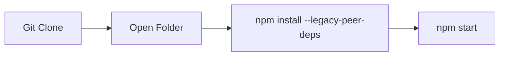

[](https://awesome.re)


<p align="center">
  <a href="evehubsrm.vercel.app">
    
  </a>

</p>
<h1 align="center" >EveHub : All events at one place </h1>

  
</p>

EventHub SRM is a comprehensive web application built using ReactJS for the frontend, Appwrite Cloud Client SDK for database management, storage, user authentication, and real-time notifications, and TailwindCSS for intuitive UI styling.

This repository serves as a centralized platform to explore and manage events happening at SRM KTR Campus. It features an integrated events calendar showcasing all upcoming events organized by various clubs, complete with details such as date, time, venue, event type (offline/online), and contact information.

<br>

## Demo Screenshot of Home Page


## Setting Up EveHub

1. Installing Dependencies:
    ```bash
       npm install --legacy-peer-deps

2. Starting the Server:
    ```bash
      npm start
<br>

<p>Running website on Local Host</p>



 ## 💻 Current Tech Stack
<div style="display: inline_block"><br>
  
  
  
  
  
</div>

<div><h2><strong>Developer of this project 🔻</strong></h2></div>

<table align="center">
<tr align="center">
<td>

**ADITYA VERMA**

<p align="center">

</p>
<p align="center">
<a href = "https://github.com/ADITYAVOFFICIAL"></a>
<a href = "https://www.linkedin.com/in/aditya-verma-real/">

</a>
<a href = "https://medium.com/@adityaver">

</a>
</p>
</td>
</table>

 ## Current Contributors 🔻
<div align="center">
  <a href="https://github.com/ADITYAVOFFICIAL/EveHub/graphs/contributors">
  
</a>
</div>

